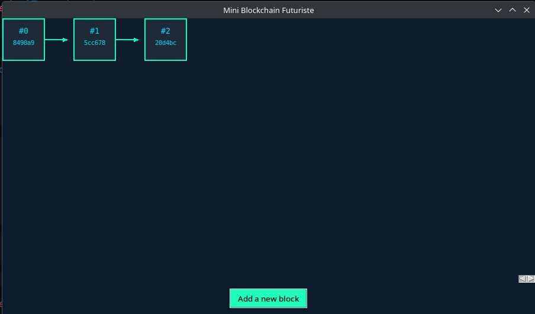
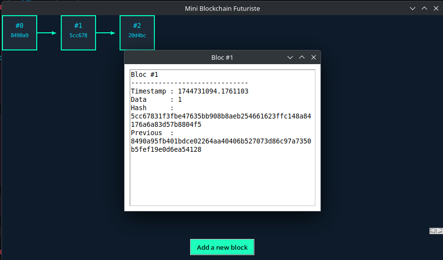

# prototype-blockchain

This is a very small simulation of a regular blockchain. It's just a prototype with the goal of creating a real private blockchain framework in Rust later.

👉 To launch :
```bash
python main.py
```

---

## The application interface


---

## Details contained in the blocks


---

# What is a Blockchain?

A blockchain is a chain of blocks that store information in a specific way.
It’s like a digital ledger where each page (block) is connected to the next, forming a secure and traceable chain.


## What is a Block?

A block is a container that holds data.
_Each block typically includes the following key elements:_

- **Block Data :** This is the actual content the block stores — like transactions, messages, or records.
- **Timestamp :** When the block was created.
- **Previous Block Hash :** A unique fingerprint of the previous block in the chain. This is what links blocks together.
- **Current Block Hash :** A fingerprint created from this block's content. It changes if the block is modified.

## How Blocks are Connected

Think of each block as a link in a chain.
Every block contains the hash of the previous block, creating a chain of trust.

Here’s how it works:

- Block 1 : The first block (called the Genesis Block) has no previous hash.
- Block 2 : Contains its own data + the hash of Block 1.
- Block 3 : Contains its data + the hash of Block 2.
- And so on...

If someone tries to change data in Block 2, its hash changes → this breaks Block 3, Block 4, etc.
This makes the chain tamper-evident.


## Why is This Useful?

Every block is linked to the one before it.
Any modification breaks the chain unless all following blocks are also recalculated.
This makes blockchains secure and transparent.
